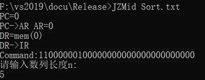
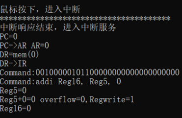

# MIPS-Emulator
C++实现MIPS指令集虚拟机

## 一、开发环境

Win10 64位操作系统PC机，基于 Visual Studio 开发环境，C++面向对象编程语言

## 二、实验环境

存储空间为4GB，将MIPS指令集分为R、I、J型指令

## 三、使用说明

### 3.1 运行方式

#### 3.2.1 机器语言

将要测试的机器码写在Release下的Machine.txt文档中（格式需与文档中相同），根据Release下的README.txt的说明运行。

#### 3.2.2 汇编语言

将要测试的机器码写在Release下的Assembly.txt文档中（格式需与文档中相同），根据Release下的README.txt的说明运行。

### 3.2 支持的指令

#### 3.2.1 指令类型

我们的指令集支持包含R、I、J型指令在内的共31种指令，如下给出了具体指令格式。

**R型指令：**

| **add rd, rs, rt**  | **addu rd, rs, rt** | **sub rd, rs, rt**  |
| :-----------------: | :-----------------: | :-----------------: |
| **subu rd, rs, rt** | **and rd, rs, rt**  |  **or rd, rs, rt**  |
| **xor rd, rs, rt**  | **nor rd, rs, rt**  | **slt rd, rs, rt**  |
| **sltu rd, rs, rt** | **slt rd, rt，imm** | **srl rd, rt，imm** |
| **sra rd, rt，imm** | **sllv rd, rt, rs** | **srlv rd, rt, rs** |
| **srav rd, rt, rs** |      **jr rs**      |                     |

**I型指令：**

| **addi rt,rs,imm**  | **addiu rt,rs,imm** | **andi rt,rs,imm**  |
| :-----------------: | :-----------------: | :-----------------: |
|  **ori rt,rs,imm**  | **xori rt,rs,imm**  |   **lui rt,,imm**   |
| **lw rt, imm(rs)**  | **sw rt, imm(rs)**  | **beq rs, rt, imm** |
| **bne rs, rt, imm** | **slti rs,rt,imm**  | **sltiu rs,rt,imm** |

**J型指令：**

|  **j address**  |
| :-------------: |
| **jal address** |

其中，输入寄存器rs、rt、rd时应使用$寄存器名的格式，如$a0, $t1,$zero；

具体输入指令格式如：addi $t0,$zero,0；bne $t0,$a0,-32；lw $a1,1000($t1)；

#### 3.2.2 输出解释：

#### 3.2.3 可能的错误：

1. 使用了错误的寄存器名称，如addi $t33,$zero,0。不存在$t33寄存器引发错误。

   

2. 输入指令格式错误，参数过多，如addi $t0,$zero,0,4。addi后应跟两个寄存器，一个立即数。

   

3. 输入了错误或不存在的指令，如ADD $t0,$zero,0。因不存在ADD指令而报错。

   

### 3.3 样例使用

#### **3.3.1 斐波那契数列测试**

在Release下有斐波那契数列的汇编测试代码，命令行输入：JZMid Fibonacci.txt

执行指令后，程序提是输入数列长度n（输入5）：

此时输入数列长度n=5，继续运行，中间输出指令微操作：

**最终得到长度为n的斐波那契数列：**

#### **3.3.2 冒泡排序测试**

在Release下有冒泡排序的汇编测试代码，命令行输入：JZMid Sort.txt

执行指令后，程序提是输入数列长度n（输入5）：

此时输入数列长度n=5，继续运行，中间输出指令微操作：

此时程序提示输入第1个数字（输入5），依次输入n=5个数字（依次输入5，3，4，1，2），最后打印排序后的结果：

#### 3.3.3 同步中断测试

在Release下有同步中断的汇编测试代码，命令行输入：JZMid SynIntTest.txt IntService.txt

#### 3.3.4 异步中断测试

在Release下有异步中断的汇编测试代码，命令行输入：JZMid AsyIntTest.txt IntService.txt

在适当时候按下键盘或鼠标进行异步中断

打印鼠标事件：

打印键盘事件：

### 3.4 注意事项

**在运行非异步中断代码时，一定不能点击鼠标或键盘，否则会进入异步中断！！！**